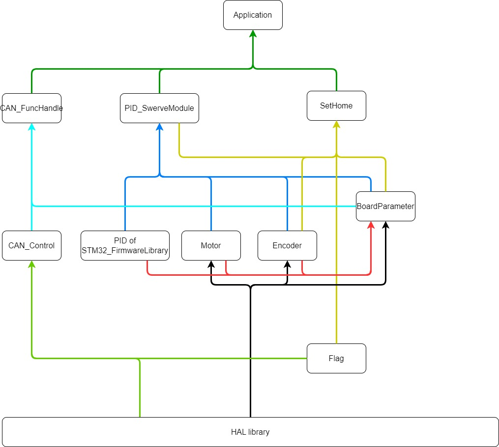

# Cấu trúc tổ chức chương trình cụm bánh Swerve

Mô hình tổ chức các module chức năng:

## Module chức năng

+ __CAN_Control__

    Sử dụng API của thư viện HAL thực hiện các chức năng:

    + Cấu hình gói tin gửi txHeader.
    + Đóng gói bản tin CAN gửi đi và giải mã gói tin nhận được.
    + Xử lý dữ liệu và set cờ các sự kiện khi 
    nhận được bản tin CAN.
    + Cấu hình bộ lọc ở Scaleable 16 bit ở mode List để lọc gói tin tương ứng với từng địa chỉ(ID) của từng cụm bánh.

    Tham khảo [CAN_Control](README_Module/CAN_Control.md)

+ __CAN_FuncHandle__ 

    Nhận dữ liệu từ layer Application và điều khiển layer CAN_Control để truyền gói tin, xử lý dữ liệu nhận được từ gói tin CAN và trả về cho layer Application
.
    + Truyền nhận gói tin tốc độ BLDC và góc quay DC.
    + Truyền nhận, điều khiển quá trình SetHome cụm bánh.
    + Truyền nhận đưa cụm bánh vào chế độ hủy bảo vệ JY-01 BLDC.
    + Truyền nhận chế độ Test.
    + Truyền nhận 5 thông số PID: kp, ki, kd, alpha, deltaT cho 3 bộ PID là tốc độ BLDC, tốc độ DC và góc quay DC.
    + Truyền nhận xung encoder BLDC.

    Tham khảo [CAN_FuncHandle](README_Module/CAN_FuncHandle.md)

+ __Motor__

    Khởi tạo chân điều khiển cho động cơ DC và BLDC, thay đổi Duty Cycle của PWM cấp cho 2 động cơ DC và BLDC.
    Tham khảo [CAN_FuncHandle](README_Module/Motor.md)
+ __Encoder__

    Đảm nhiệm việc khởi tạo và cấu hình bộ Timer cụ thể cho chức năng Timer Encoder, Timer sẽ tự động đếm số xung encoder đọc được, tăng giảm xung tùy vào chiều quay của 2 kênh A, B.

    Dùng để tính số xung đọc được trong khoảng thời gian lấy mẫu (deltaT) nhất định (dùng cho PID), hoặc trả về tổng số xung đọc được khi xoay encoder(dùng để test chức năng).
    Tham khảo [CAN_FuncHandle](README_Module/Encoder.md)

+ __SetHome__

    Điều khiển quy trình xoay cụm bánh đến vị trí cài đặt gốc ban đầu - vị trí lắp cảm biến hồng ngoại chữ U 24V, sau đó sẵn sàng nhận lệnh từ main F4 để điều khiển xoay bánh DC và chạy BLDC.
    Tham khảo [CAN_FuncHandle](README_Module/SetHome.md)
+ __PID_SwerveModule__

    Đảm nhiệm việc tính toán thông số PID cho động cơ DC và BLDC theo SetPoint đặt trước, một cụm bánh có 3 thông số PID như sau:

    + PID tốc độ cho DC, được chạy trong quá trình SetHome.
    + PID tốc độ cho BLDC, được chạy sau quá trình SetHome.
    + PID vị trí cho DC lồng với PID vận tốc, được chạy sau quá trình SetHome - quá trình vận hành bình thường của cụm bánh.
    Tham khảo [CAN_FuncHandle](README_Module/PID_Swerve.md)
+ __BoardParameter__

    Chứa và quản lý tất cả các đối tượng, thông số cần thiết để điều khiển cụm bánh bao gồm các đối tượng sau:

    + Giá trị cài SetPoint cho góc quay DC(targetAngleDC) và SetPoint tốc độ BLDC(targetSpeedBLDC).
    + Đối tượng động cơ DC (include từ Motor.h).
    + Đối tượng động cơ BLDC(include từ Motor.h).
    + Đối tượng Encoder DC (include từ Encoder.h).
    + Đối tượng Encoder BLDC (include từ Encoder.h).
    + Đối tượng PID tốc độ BLDC, tốc độ DC, vị trí DC (include từ PID.h trong STM32_FirmwareLibrary).
    Tham khảo [CAN_FuncHandle](README_Module/BoardParamter.md)
    __*Lưu ý*__: 
    
    - Các thông số trong BoardParameter không được truy xuất trực tiếp tới member từ các file bên ngoài (private biến) ngoại trừ chính BoardParameter.c

    - Để lấy thông số từ BoardParamter thì gọi các hàm API được public (các public function prototype) được cung cấp sẵn trong file BoardParameter.h bắt đầu bằng brd_Get*. Còn để cài đặt giá trị cho một đối tượng hoặc một thông số trong BoardParameter thì dùng các hàm bắt đầu bằng brd_Set*

    

