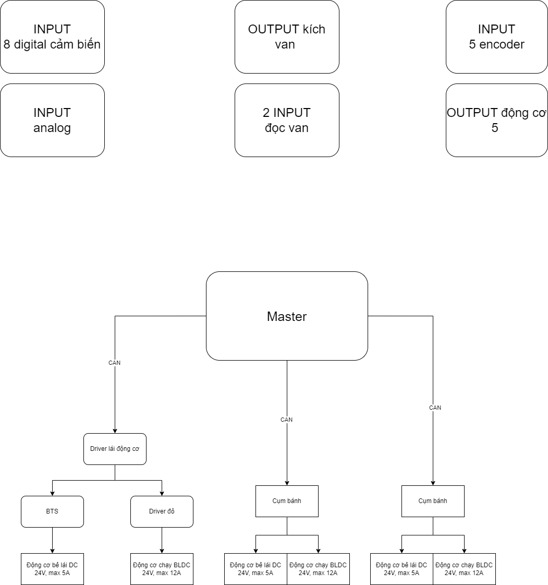
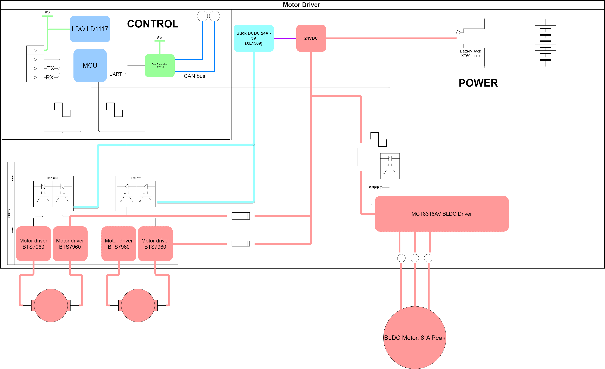

# Tổng quan hệ thống

## Driver điều khiển motor

Các thành phần không thuộc board mạch:
- Pin lithium 24V
- Cơ cấu chấp hành: 2 động cơ 24VDC
    - Động cơ DC
    - Động cơ DC HOẶC động cơ không chổi than BLDC
- Thành phần phản hồi bao gồm:
    * Cảm biến hồng ngoại 24VDC dùng để set home cho động cơ bẻ lái góc
    * Encoder cho động cơ bẻ lái dùng 5V
    * Encoder cho động cơ chạy dùng 5V
### Yêu cầu chính
1. Mô tả yêu cầu thiết kế: 

Thiết kế board mạch điều khiển phần cơ khí là đế Swerve gồm có 2 động cơ, một dùng để xoay góc phương ngang, một động cơ dùng để chạy tiến lùi theo phương dọc

2. Các phương án được đề xuất sử dụng với board mạch thiết kế:
    * Phương án 1: Điều khiển 1 động cơ DC bẻ lái góc, 1 động cơ chạy tiến lùi BLDC
    * Phương án 2: Điều khiển 2 động cơ DC 
3. Các yêu cầu board mạch cần phải đáp ứng bao gồm:
    * Đọc được cảm biến sethome 24VDC có cách ly
    * Đọc được encoder từ động cơ bẻ lái
    * Đọc được encoder từ động cơ chạy tiến lùi
    * Điều khiển tốc độ động cơ PWM với động cơ bẻ lái
    * Điều khiển tốc độ động cơ PWM với động cơ tiến lùi
    * Giao tiếp được với các board controller khác thông qua giao tiếp CAN bus
    * Nguồn đầu vào công suất 24VDC
    * Nguồn điều khiển là 3.3V
    * Bảo vệ được động cơ
    * Cách ly phần điều khiển và công suất
    
## Giải pháp điều khiển
- Sử dụng chuẩn giao tiếp CAN bus để giao tiếp với master dùng IC [TJA1050](https://www.nxp.com/docs/en/data-sheet/TJA1050.pdf) hoặc [MCP2551](https://www.thegioiic.com/mcp2551-i-sn-ic-can-transceiver-8-soic)
- Dùng 1 opto cách ly tốc độ cao 2 kênh [HCPL2631](https://icdayroi.com/hcpl2631), mỗi bên điều khiển nửa cầu [BTS7960](https://www.thegioiic.com/bts7960-module-dieu-khien-dong-co-dc-43a)
- 1 Opto cách ly thường 4 kênh [PS2801-4](https://www.thegioiic.com/ps2801-4-optoisolator-transistor-output-2500vrms-4-channel-16-soic) hoặc 4 opto [PC817](https://www.thegioiic.com/pc817x2nip0f-optoisolator-transistor-output-5000vrms-1-channel-4-smd) để cách ly các chân sau:
    - Break (Driver BLDC)
    - Dir (Driver BLDC)
    - Fault (Driver BLDC)
    - Output cảm biến 24V
- 1 Driver điều khiển động cơ BLDC 8A-peak [MCT8136AV](https://www.ti.com/lit/ds/symlink/mct8316a.pdf) hoặc 1 module [JY-01](https://www.thegioiic.com/mach-dieu-khien-dong-co-brushless-with-hall-6-50v-380w)
- Dùng 2 opto cách ly tốc độ cao 2 kênh [HCPL2631](https://icdayroi.com/hcpl2631), mỗi bên điều khiển nửa cầu [BTS7960](https://www.thegioiic.com/bts7960-module-dieu-khien-dong-co-dc-43a)
* Nguồn cách ly sử dụng [B0505S 2W](https://www.thegioiic.com/b0505s-2wr2-chuyen-doi-dc-dc-vao-5v-ra-5v-2w) 

### Yêu cầu phụ
* Thử nghiệm nguồn LDO và Buck tích hợp bên trong MCT8316
* Thiết kế chuẩn nạp và giao tiếp UART khớp với mạch nạp ST-link V2.1
* Giao tiếp I2C giữa MCU trên board và MCT8316 hoặc từ MCU bên ngoài giao tiếp để cài đặt thông số cho MCT8316

Bảng chân ngoại vi của board driver 

| Pin Number | Function           | Isolator        | Device Pin Number | Pin Function | Device Name      |
|------------|--------------------|-----------------|-------------------|--------------|------------------|
| 10(PA0)    | TIM2_CH1_PWM (DC)  | HCPL2631 (Pin 4)| 2                 | IN           | BTS7960 (1)      |
| 11(PA1)    | TIM2_CH2_PWM (DC)  | HCPL2631 (Pin 1)| 2                 | IN             | BTS7960 (1)      |
|            |                    |                 |                   |              |                  |
| 13(PA3)    | TIM2_CH4_PWM       | HCPL2631 (Pin 4)| 2                 | IN           | BTS7960 (2)      |
| 12(PA2)    | TIM2_CH3_PWM       | HCPL2631 (Pin 1)| 2                 | IN             | BTS7960 (2)      |
|            |                    |                 |                   |              |                  |
| 42(PB6)    | TIM4_CH1_ENCODER   | X               | 1                 | CHANNEL_A    | ENCODER (1)      |
| 43(PB7)    | TIM4_CH2_ENCODER   | X               | 2                 | CHANNEL_B    | ENCODER (1)      |
|            |                    |                 |                   |              |                  |
| 16(PA6)    | TIM3_CH1_ENCODER   | X               | 1                 | CHANNEL_A    | ENCODER (2)      |
| 17(PA7)    | TIM3_CH2_ENCODER   | X               | 2                 | CHANNEL_B    | ENCODER (2)      |
|            |                    |                 |                   |              |                  |
| 11(PA1)    | TIM2_CH2_PWM (BLDC)| ISO7721DR       | 28                | SPEED/WAKE   | MCT8316          |
| 25(PB12)   | GPIO_INPUT         | ISO7721DR       | 29                | FG           | MCT8316          |
| 26(PB13)   | GPIO_INPUT         | EL817           | 40                | nFAULT       | MCT8316          |
| 14(PA4)    | GPIO_OUTPUT        | EL817           | 35                | BRAKE        | MCT8316          |
| 10(PA0)    | GPIO_OUTPUT (BLDC) | EL817           | 34                | DIR          | MCT8316          |
|            |                    |                 |                   |              |                  |
| 30(PA9)    | USART1_TX          | X               |                   | USART_RX     | STM32F407VCT6    |
| 31(PA10)   | USART1_RX          | X               |                   | USART_TX     | STM32F407VCT6    |
| 21(PB10)   | USART3_TX          | X               |                   | USART_RX     | STM32F407VCT6    |
| 22(PB11)   | USART3_RX          | X               |                   | USART_TX     | STM32F407VCT6    |
