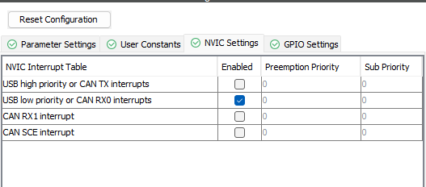

# CAN BUS GUIDE
## Định dạng gói tin của giao thức CAN - The Bit Fields of CAN
### Giao thức thông thường - Standard CAN


**SOF(Start of Frame)**: bit mở đầu dữ liệu. (1 bit)

**Identifier**: ID của thiết bị truyền dữ liệu. (11 bit)

**RTR(Remote Transmission Request)**: dùng để xác định nhận data(RTR = 0) hay xóa data cũ để nhận data từ thiết bị mới(RTR = 1). (1 bit)

**IDE(Identifier Extension)**: xác định ID thường hay ID mở rộng. (1 bit)

**r0**: bit dự trữ (1 bit)

**DCL(Data Length Code)**: kích thước của dữ liệu. (4 bit)

**Data Field**: Dữ liệu (từ 0 đến 8 byte)

**CRC(Cyclic Redundancy Check)**: Kiểm tra lại tổng số bit đã được truyền đi. (15 bit với CAN 2.0A và 17 bit CAN 2.0B - CAN mở rộng)

**ACK(Acknowledge)**: Nếu thiết bị nhận được dữ liệu hợp lệ từ CAN thì sẽ gửi lại ACK bit để xác nhận. (2 bit)

**EOF(End of Frame)**: Tín hiệu kết thúc truyền chuỗi dữ liệu. (7 bit)

**IFS(Interframe Space)**: bit tạo thời gian chờ cho thiết bị khác truyền dữ liệu. (3 bit)

### Giao thức mở rộng -  Extended CAN


## Bộ lọc gói tin CAN bus - CAN Bus Filter
### Khái quát về bộ lọc
Trong giao thức CAN, bộ lọc CAN (CAN Bus Filter) là một tính năng quan trọng được hỗ trợ trong vi điều khiển STM32 và các vi điều khiển khác. Bộ lọc này cho phép xác định thông điệp nào sẽ được chấp nhận bởi vi điều khiển. Khi một thông điệp được nhận vào vi điều khiển, nó sẽ so sánh với các bộ lọc được cấu hình trước đó. Nếu thông điệp khớp với bộ lọc nào, vi điều khiển sẽ lưi thông điệp vào ô nhớ FIFO (First In First Out) hoặc FIFO truyền, hoặc kích hoạt ngắt (Interrupt) để thông báo về việc nhận thông điệp.

Bộ lọc CAN Thường bao gồm 2 phần quan trọng:
- **32-bit filter mask (Msk)**: Đây là giá trị mask được dùng để quyết định thông điệp nào sẽ được lưu trữ hoặc nhận dựa trên ID (Identifier) của thông điệp.
- **32-bit filter code (Id)**: Đây là giá trị ID mà thông điệp được so sánh với. Nếu một thông điệp có ID khớp với bộ lọc, nó được chấp nhận.

Một số bộ lọc có thể được cấu hình để xử lý một số ít thông điệp hoặc các nhóm thông điệp dựa trên ID. Bộ lọc cũng có thể được cấu hình để chấp nhận hoặc từ chối các thông điệp có chiều dài dữ liệu (DLC) cụ thể.

Việc sử dụng bộ lọc CAN giúp giảm tải xử lý của vi điều khiển bằng cách chỉ xử lý các thông điệp quan trọng và loại bỏ những thông điệp không liên quan, đồng thời giúp tránh xảy ra lỗi khi nhận nhầm thông điệp từ các thiết bị không mong muốn trên mạng CAN.

### Thuộc tính cài đặt trong struct canfilterconfig 

```
        CAN_FilterTypeDef canfilterconfig;

        canfilterconfig.FilterActivation = CAN_FILTER_ENABLE;
        canfilterconfig.FilterBank = 18;  
        canfilterconfig.FilterFIFOAssignment = CAN_FILTER_FIFO0;
        canfilterconfig.FilterIdHigh = 0x123 << 5;                      /* 0000000100100011 */
        canfilterconfig.FilterIdLow = 0;
        canfilterconfig.FilterMaskIdHigh = 0x7FF << 5;                  /* 0000011111111111 */
        canfilterconfig.FilterMaskIdLow = 0x0000;
        canfilterconfig.FilterMode = CAN_FILTERMODE_IDMASK;
        canfilterconfig.FilterScale = CAN_FILTERSCALE_32BIT;
        canfilterconfig.SlaveStartFilterBank = 20;  

        HAL_CAN_ConfigFilter(&hcan1, &canfilterconfig);
```

**FilterActivation**: sử dụng bộ lọc hay không.

**FilterBank**: là tập hợp các thuộc tính bộ lọc được hỗ trợ bởi phần cứng của vi điều khiển cho phép ta cấu hình nhiều bộ lọc CAN để lọc các thông điệp CAN theo nhiều tiêu chí khác. Số lượng `FilterBank` phụ thuộc vào phần cứng điều khiển. Nó sẽ bao gồm các thông tin như lọc ID nhận vào, thông tin nhận vào, lọc theo hướng (Chỉ truyền hoặc chỉ nhận), lọc theo chiều dài dữ liệu. Chọn số nằm giữa 0 và `SlaveStartFilterBank`.

**FilterFIFOAssignment**: lựa chọn FIFO nào để nhận dữ liệu từ CAN Bus (thông thường có 2 kênh là FIFO0 và FIFO1).


**FilterMode**: có 2 chế độ lọc là Mask Mode và List Mode.
- **Mask Mode**: trong chế độ này cần phải xác định `Filter ID` và `Filter Mask`. `Filter Mask` sẽ xác định bit nào trong `Filter ID` là quan trọng để lọc sau đó nếu ID nhận được khớp với `Filter ID` thì dữ liệu sẽ được chấp nhận. Ngược lại sẽ bị từ chối. Chế độ này cho phép chúng ta lọc thông tin theo mấu ID hoặc ID cụ thể (Thường được sử dụng nhiều hơn).
- **List Mode**: chế độ này bạn cần xác định một danh sách các ID mà bộ điều khiển CAN sẽ chấp nhận. Nếu dữ liệu nào có ID khớp với ID trong danh sách sẽ được chấp nhận. 

**FilterScale**: kích thước của bộ lọc: 
- **16 bit**: chỉ so sánh 16 bit đầu tiên của `Filter ID` và `Filter Mask` với ID đến và những bit còn lại coi như không có nghĩa.
- **32 bit**: bộ lọc sử dụng toàn bộ 32 bit của `Filter ID` và `Filter Mask` để so sánh với ID của dữ liệu truyền đến. 
    
**FilterIdHigh**: là 16 bit đầu tiên của ID lọc. Giá trị được cài đặt ở đây sẽ so sánh với ID của dữ liệu truyền đến. Ở đoạn ví dụ trên ta chỉ muốn so sánh Standard ID thì Standard ID được bắt đầu từ bit thứ 5 của ID High Register nên phải dịch sang trái 5 bit.

**FilterMaskIdHigh**: là 16 bit đầu tiên của mặt nạ lọc. 


**SlaveStartFilterBank**: số bộ lọc muốn nhận vào CAN 1(Master CAN). Khi điều khiển với 2 Node đầu cuối ta có thể cấu hình tới 28 thông số lọc. Tuy nhiên chức năng này vô dụng nếu chỉ có 1 điểm đầu (và 1 điểm đầu có thể cấu hình đến 14 bộ lọc từ 0 - 13). 

## Các công cụ kiểm tra và sửa lỗi được hỗ trợ trong vi điều khiển
### Loopback mode


Đây là chức năng hữu dụng của CAN khi cho phép ta gửi thông tin và đồng thời nhận lại chính cái thông tin vừa gửi đi. Tuy nhiên, khi ở chế độ này, vi điều khiển sẽ chặn hết tất cả các thông tin truyền từ bên ngoài vào vi điều khiển. `Loopback mode` thường được dùng cho mục đích kiểm tra và sửa lỗi khi cho phép các node xác nhận sự chuẩn xác của thông tin vừa gửi đi.

### Silent mode


Trái ngược với `Loopback mode` thì `Silent mode` sẽ cho phép chúng ta nhận thông tin từ bên ngoài và thông tin gửi đi cũng sẽ được trả ngược về vi điều khiển. Và ở chế độ này thông tin sẽ không được gửi xuống CANH và CANL. `Silent mode` chuyên dùng cho việc kiểm tra thông tin trên đường dây.

### Silent + Loopback mode


Khi ở chế độ này ta sẽ tổng hợp được tất cả tính năng của `Silent mode` và `Loopback mode` đều chặn hết thông tin truyền đi và nhận về từ CANH và CANL. Khi ở chế độ này thì ta sẽ truyền và nhận thông tin trên chính vi điều khiển của mình mà không phải nối thêm module chuyển đổi CAN.

## Truyền Nhận dữ liệu

### Cấu hình CubeMX





```
Time quantum = APP1 / 
